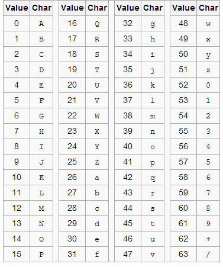

# base64

## introduction(what)
* Base64 is a `binary-to-text` encoding methodology that helps **represent binary data in ASCII string format**. It’s often used to encode data for transmission over media that are mostly text, like emails, JSON-based APIs, etc., so that binary data like images and files don’t get corrupted.
* The term Base64 comes from the fact that it uses 64 characters – A-Z, a-z, 0-9, +, and / to represent data.

## metric&weakness
### metric
Base64 is:
- `Text-safe`: Can embed binary data in text-based formats like HTML, XML, JSON, etc.
- `Easy to transport`: No issues with character encoding or data corruption.
- `Common for images`: Often used in web development to embed images directly in HTML/CSS or JSON payloads.

### weakness
- `Size Overhead (~33%)`
- `Memory & CPU Load`: Converting and buffering an entire image at once can spike overall memory usage during encoding. Similarly, decoding into raw bytes and then parsing via an image library also adds CPU overhead.
- `Security Considerations`: If we blindly concatenate Base64 strings into HTML or JSON without cleaning, you could open XSS or JSON‑injection vectors. Also, extremely large Base64 data can exhaust the parsers and enforce maximum payload sizes at the gateway.


| Encoding | Purpose                     | Use Case                                      | Size Impact            |
|----------|-----------------------------|-----------------------------------------------|------------------------|
| Base64   | Binary to text              | Embedding images/files in HTML, JSON, etc.    | ~33% increase          |
| Hex      | Binary to Hexadecimal       | Debugging, network traces                     | ~100% increase         |
| Gzip     | Compression                 | Actual size reduction for text/binary         | Compression ratio-dependent |

## How Does Base64 Work?
### Step 1: Convert the Text to ASCII Bytes

| Character | ASCII Decimal Value | Binary Value (8 bits) |
|-----------|---------------------|-----------------------|
| H         | 72                  | 01001000              |
| e         | 101                 | 01100101              |
| l         | 108                 | 01101100              |
| l         | 108                 | 01101100              |
| o         | 111                 | 01101111              |

So now, our string “Hello” would look like 01001000 01100101 01101100 01101100 01101111.

That’s 5 characters × 8 bits = 40 bits.

### Step 2: Break the Binary into 6-bit Groups
Base64 operates on 6-bit blocks, so we group the 40 bits into chunks of 6 which was previously in chunks of 8: 

01001000 01100101 01101100 01101100 01101111

When these chunks of 8 are grouped in groups of 6 they look like this:

010010 000110 010101 101100 011011 000110 1111

Since 40 isn’t directly divisible by 6, we have to pad some 0s at the end. We now have 6 full 6-bit blocks and 1 leftover 4-bit block. We pad the last block with 2 zero bits to make it a full 6-bit chunk:

010010 000110 010101 101100 011011 000110 1111**00**

### Step 3: Convert 6-bit Groups to Decimal
We know 2^6 is 64. So, our range will be in between 0 to 63.

| 6-bit Binary | Decimal |
|--------------|---------|
| 010010       | 18      |
| 000110       | 6       |
| 010101       | 21      |
| 101100       | 44      |
| 011011       | 27      |
| 000110       | 6       |
| 111100       | 60      |

### Step 4: Map to Base64 Characters
Following the standard Base64 character table, we will map our decimal values to the corresponding characters.


| Decimal | Base64 Character |
|---------|------------------|
| 18      | S                |
| 6       | G                |
| 21      | V                |
| 44      | s                |
| 27      | b                |
| 6       | G                |
| 60      | 8                |

We get “SGVsbG8” as our Base64 encoding for our string “Hello”.

### Step 5: Add Padding
Since our original string had 5 bytes (not a multiple of 3), Base64 requires padding with **“=”** to make the output length a multiple of 4 characters.

5 bytes = 40 bits -> 6 full base64 chars + 2 more characters (from padded bits) -> Total 8 characters

Final Base64 encoded string: “Hello” -> SGVsbG8=

## Python Implementation of Base64
```python
import base64

# Text encoding
message = "Hello World"
encoded = base64.b64encode(message.encode())
print("Encoded:", encoded)
 
# Decoding it back
decoded = base64.b64decode(encoded).decode()
print("Decoded:", decoded)
```

```python
from PIL import Image
import base64
import io

# Load and encode image

img = Image.open("example.jpeg")
buffered = io.BytesIO()

img.save(buffered, format="JPEG")
img_bytes = buffered.getvalue()
img_base64 = base64.b64encode(img_bytes).decode('utf-8')

print("Base64 String:", img_base64[:100], "...")  # Truncated
```

```python
from PIL import Image
import base64
import io
from IPython.display import display, Image as IPythonImage

# Assume `img_base64` is the base64 string

img_data = base64.b64decode(img_base64)

img = Image.open(io.BytesIO(img_data))
display(IPythonImage(data=img_data))
```

## 参考
https://www.analyticsvidhya.com/blog/2025/05/base64/