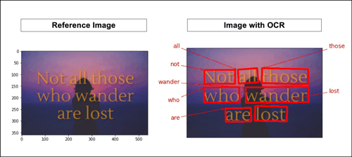

# Ordering the result of OCR
After using OCR to extract any detectable text in an image, using the **`Pythagorean Theorem`** (hello middle-school) to order the bounding boxes. Each bounding box’s center will have a distance from the origin at (0,0) and that list of distances are then sorted by its distinguished rows and columns. Note: Matplotlib displays images where the y-axis is inverted. This is normal in computer vision.

</img>

Now to put these yellow triangles into code…if triangle gets **wider**, **same row**; if triangle gets **longer** past the specified threshold, **new row**. First, get the list of all distances from origin for each bounding box. Results are stored in a list of dictionaries with multiple `(key, value)` pairs.

```python
import math
def get_distance(predictions):
    """
    Function returns dictionary with (key,value):
        * text : detected text in image
        * center_x : center of bounding box (x)
        * center_y : center of bounding box (y)
        * distance_from_origin : hypotenuse
        * distance_y : distance between y and origin (0,0)
    """
    
    # Point of origin
    x0, y0 = 0, 0
    # Generate dictionary
    detections = []
    for group in predictions:
        # Get center point of bounding box
        top_left_x, top_left_y = group[1][0]
        bottom_right_x, bottom_right_y = group[1][1]
        center_x = (top_left_x + bottom_right_x) / 2
        center_y = (top_left_y + bottom_right_y) / 2
    # Use the Pythagorean Theorem to solve for distance from origin
    distance_from_origin = math.dist([x0,y0], [center_x, center_y])
    # Calculate difference between y and origin to get unique rows
    distance_y = center_y - y0
    # Append all results
    detections.append({
                        'text':group[0],
                        'center_x':center_x,
                        'center_y':center_y,
                        'distance_from_origin':distance_from_origin,
                        'distance_y':distance_y
                    })
    return detections
```
Next, distinguish and split detections by rows and columns. Each sublist is a new row. Threshold helps determine when a row breaks off into a new row and may need to be adjusted depending on how spaced out the text is in the original image. *15 is the default value and is a good number for most syntactic texts within images*.

```python
def distinguish_rows(lst, thresh=15):
    """Function to help distinguish unique rows"""
    
    sublists = [] 
    for i in range(0, len(lst)-1):
        if lst[i+1]['distance_y'] - lst[i]['distance_y'] <= thresh:
            if lst[i] not in sublists:
                sublists.append(lst[i])
            sublists.append(lst[i+1])
        else:
            yield sublists
            sublists = [lst[i+1]]
    yield sublists
```
Final results:
```python
def main(image_path, thresh, order='yes'):
    """
    Function returns predictions in human readable order 
    from left to right & top to bottom
    """
    
    predictions = detect_w_keras(image_path)
    predictions = get_distance(predictions)
    predictions = list(distinguish_rows(predictions, thresh))
    # Remove all empty rows
    predictions = list(filter(lambda x:x!=[], predictions))
    # Order text detections in human readable format
    ordered_preds = []
    ylst = ['yes', 'y']
    for pr in predictions:
        if order in ylst: 
            row = sorted(pr, key=lambda x:x['distance_from_origin'])
            for each in row: 
                ordered_preds.append(each['text'])
    return ordered_preds
```


ref:https://shegocodes.medium.com/extract-text-from-image-left-to-right-and-top-to-bottom-with-keras-ocr-b56f098a6efe