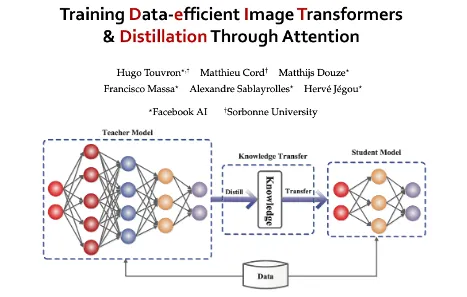
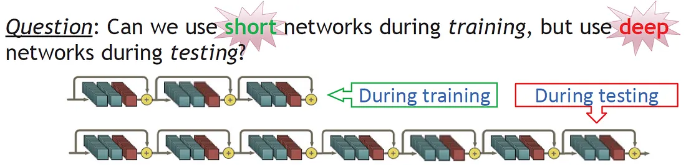
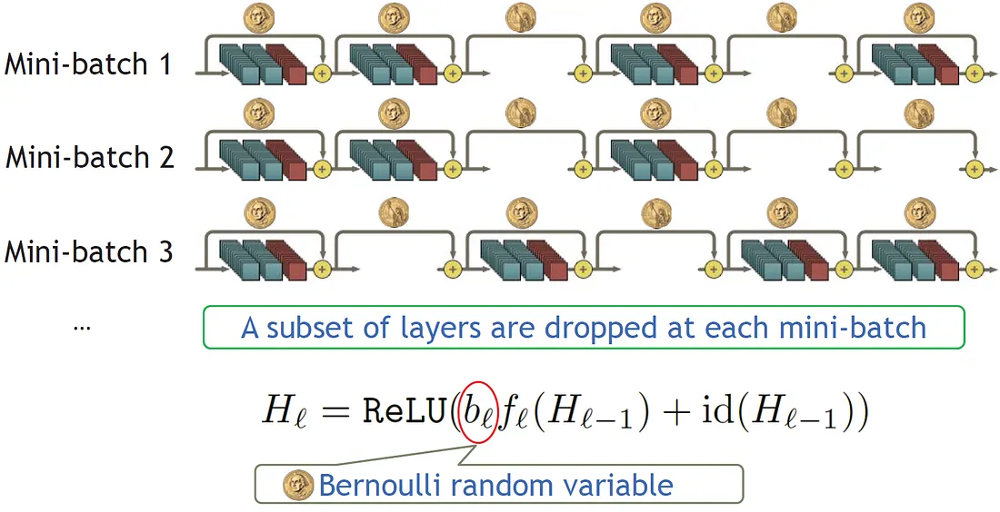
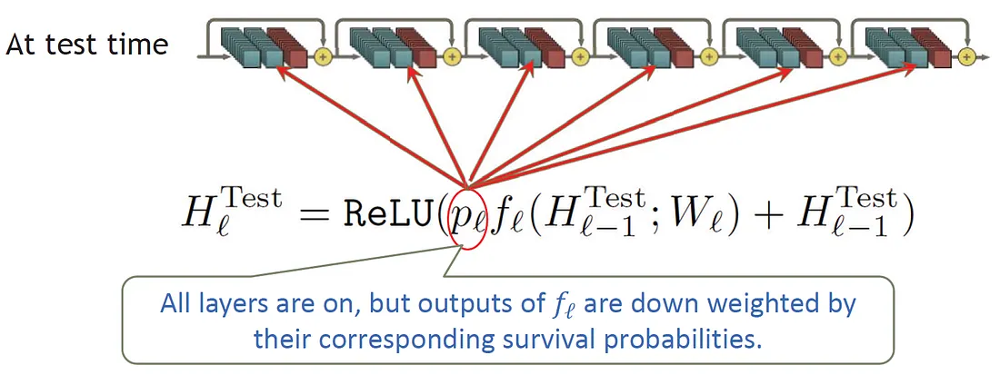
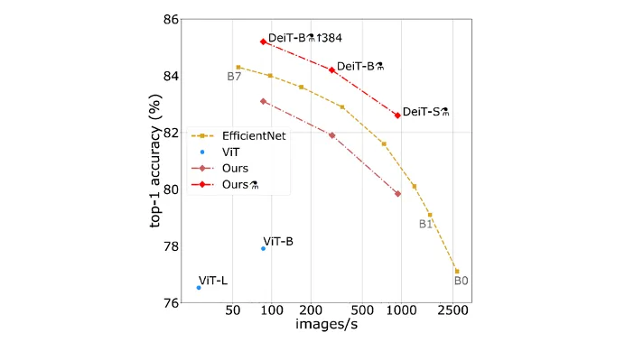
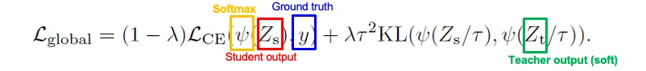
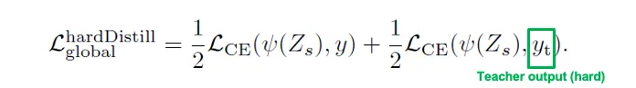
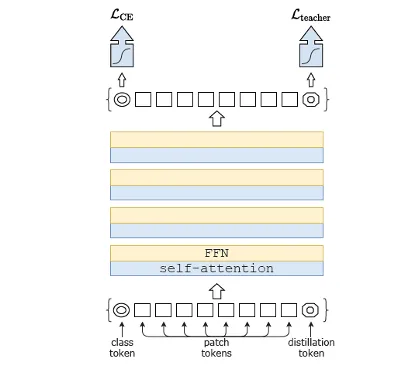

<!-- START doctoc generated TOC please keep comment here to allow auto update -->
<!-- DON'T EDIT THIS SECTION, INSTEAD RE-RUN doctoc TO UPDATE -->
**Table of Contents**  *generated with [DocToc](https://github.com/thlorenz/doctoc)*

- [蒸餾版的 ViT: DeiT (Data-efficient image Transformers)[^deit]](#%E8%92%B8%E9%A4%BE%E7%89%88%E7%9A%84-vit-deit-data-efficient-image-transformers%5Edeit)
  - [1. Data efficient training](#1-data-efficient-training)
    - [1.1. Optimization solver](#11-optimization-solver)
    - [1.2 Data augmentation](#12-data-augmentation)
    - [1.3 Regularization](#13-regularization)
  - [2. Apply distillation to ViT](#2-apply-distillation-to-vit)
    - [2.1 性能比较](#21-%E6%80%A7%E8%83%BD%E6%AF%94%E8%BE%83)
  - [3. Distillation (蒸餾)](#3-distillation-%E8%92%B8%E9%A4%BE)
    - [两种不同的蒸馏方法——硬蒸馏vs软蒸馏](#%E4%B8%A4%E7%A7%8D%E4%B8%8D%E5%90%8C%E7%9A%84%E8%92%B8%E9%A6%8F%E6%96%B9%E6%B3%95%E7%A1%AC%E8%92%B8%E9%A6%8Fvs%E8%BD%AF%E8%92%B8%E9%A6%8F)
    - [DeiT 如何让 Transformer 进行蒸馏](#deit-%E5%A6%82%E4%BD%95%E8%AE%A9-transformer-%E8%BF%9B%E8%A1%8C%E8%92%B8%E9%A6%8F)
  - [参考文献](#%E5%8F%82%E8%80%83%E6%96%87%E7%8C%AE)

<!-- END doctoc generated TOC please keep comment here to allow auto update -->

# 蒸餾版的 ViT: DeiT (Data-efficient image Transformers)[^deit]
Training data-efficient image transformers & distillation through attention

DeiT 的目标是让网络参数量减少（与 CNN 处于同一水平），预训练时所需训练数据集规模减小（无需在 JFT 数据集上预训练，仅使用 ImageNet1K 即可）。并且无需使用 TPU 进行训练，仅需使用 GPU 训练三天就能得到性能不错的预训练模型。

</img>

在这篇论文中，数据高效训练采用了当前模型中常用的现有技术，大致分为三个部分：训练网络的优化器、数据增强以及网络训练时的正则化。

## 1. Data efficient training
### 1.1. Optimization solver
* **AdamW** [Loshchilov & Hutter, arXiv’17], Adam with weight decay
### 1.2 Data augmentation
* **Rand-Augment** [Cubuk et al. arXiv’19]
* **Mixup** [Zhang et al. arXiv’17]
* **CutMix** [Yun et al. arXiv’19]
### 1.3 Regularization
* **Stochastic depth** [^StochasticDepth]

    <!-- </img> -->

      Stochastic depth training phase  </img>

      Stochastic depth test phase  </img>

    By using **Stochastic Depth**, the network is shorten during training, i.e. a subset of layers is **randomly** dropped and bypass them with the identity function. And a full network is used during testing/inference. By this mean:
      * Training time is reduced substantially
      * Test error is improved significantly as well
    
* **Random erasing** [Zhong et al. AAAI’20]
* **Repeated augmentation** [Hoffer et al. CVPR’20]

## 2. Apply distillation to ViT
### 2.1 性能比较
如下图所示，论文中通过 DeiT、ViT 和 EfficientNet（Noise Student）进行了效能与准确度的对比。X 轴表示每秒可分类的图像数量，Y 轴表示模型在 Top-1 准确率上的表现，因此越靠近右上角的模型综合性能越优（即速度更快且准确率更高）。图中所有模型均采用 ImageNet1K（约 140 万张图像）进行预训练，计算效能测试均基于 Nvidia V100 显卡完成。

可以观察到，ViT 在图中位于左下角位置，相比其他模型表现出速度慢且准确率低的特点。其准确率较低的原因在前文中已有说明：ViT 需要在极其庞大的数据集和充分的训练条件下才能发挥优势，而本次实验仅使用了中等规模的数据集。图中第二条浅红色曲线代表仅采用数据高效训练（Data Efficient Training）技巧训练的模型，虽然较基线有一定提升，但效果仍不及基于 CNN 的 EfficientNet（图中黄色曲线）。值得注意的是，当我们在 DeiT 中引入蒸馏（Distillation）技术进行训练时（如图中红色曲线所示），其性能表现超越了 EfficientNet。

  performance  </img>

## 3. Distillation (蒸餾)
蒸馏法最初由 Geoffrey Hinton 提出，而本文将模型蒸馏的概念应用于 Transformer 架构。传统的蒸馏方法通常包含两个网络：教师网络（teacher network）和学生网络（student network）。通常会选择一个性能较强的网络作为教师网络，用以指导一个结构更简单的小型学生网络。其核心思想是让学生网络模仿教师网络的行为，实现"青出于蓝而胜于蓝"的效果——在保持模型体积更小的同时，达到甚至超越原模型的性能表现。

### 两种不同的蒸馏方法——硬蒸馏vs软蒸馏
* Soft distillation
        </img>
    > 使用`KL散度`作为`教师模型`和`学生模型`的损失函数

* Hard distillation
        </img>
    > 使用`交叉熵`作为`教师模型`和`学生模型`的损失函数

### DeiT 如何让 Transformer 进行蒸馏
选择一个教师网络（teacher network）模型（可以是 CNN 也可以是 Transformer，后续实验将验证哪种效果更优）。论文中采用了一种经过改良的 ResNet 架构——RegNetY 作为 CNN 教师网络。虽然选用了 CNN 作为教师模型，但我们仅模拟其预测行为（即利用其输出的软标签进行知识迁移），而学生模型的整体训练流程仍完全基于 Transformer 架构（如下图所示）。我们在 ViT 基础上创新性地引入了一个​​蒸馏标记（distillation token）​​：其中​​类别标记（class token）​​的目标是与真实标签（Ground truth）保持一致，而​​蒸馏标记​​则需要与教师模型预测的标签保持一致。

  Stochastic depth test phase  </img>

​文章中提到。​硬标签蒸馏（hard distillation）​​的性能显著优于​​软标签蒸馏（soft distillation）​​；
在学生模型推理阶段，​​同时利用类别标记和蒸馏标记的嵌入特征​​能获得更优的预测效果。

> 为何选择CNN作为教师模型？主要原因可归结为以下两点：
    
    * ​​小数据集上的性能优势​​
    在小型数据集（如ImageNet-1K）上，CNN模型仍能展现出比Transformer更优的预测性能。这得益于CNN在有限数据条件下更强的泛化能力。
    ​​针对图像任务的归纳偏置（Inductive Bias）​​
    CNN专为图像任务设计，其架构特性包含对图像的​​先验知识​​：
    * ​​局部连接性（Local Connectivity）​​：通过卷积核捕捉局部像素关系，符合图像局部相关性强的特点。
    ​​权重共享（Weight Sharing）​​：减少参数量的同时增强平移不变性（Translation Invariance）。
    这些特性使CNN成为理想的"知识源"，能高效地将图像理解能力蒸馏到Transformer架构中。

## 参考文献

[^StochasticDepth]: [Review: Stochastic Depth (Image Classification)](https://sh-tsang.medium.com/review-stochastic-depth-image-classification-a4e225807f4a)
[^deit]: Data-efficient Image Transformers*. Medium. https://medium.com/@andy6804tw/%E8%AB%96%E6%96%87%E5%B0%8E%E8%AE%80-%E8%92%B8%E9%A4%BE%E7%89%88%E7%9A%84-vit-deit-data-efficient-image-transformers-215796794461
