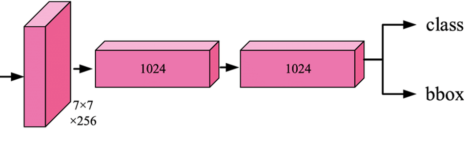

# bbox regression
The architecture of bbox regression model</img>

output of detection model: `[N, 4]` for bbox head (normalized coords) and `[N, 1]` or `[N, 2]` for class head.
loss function for bbox haed is `sigmooid` and for class is `sigmooid` or `softmax`.[^bbox-regression-single-object-detection]

## 参考文献
[^bbox-regression-single-object-detection]:bbox-regression-single-object-detection. https://www.kaggle.com/code/quadeer15sh/bbox-regression-single-object-detection