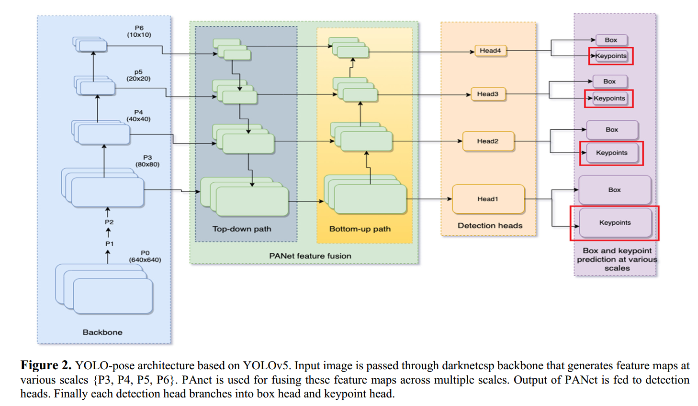

## 用途
* 姿态检测 
* 物体姿态估计 
* 人脸识别与匹配 
* 面部表情识别
> ref:https://so-development.org/how-to-use-yolo11-for-pose-estimation/

## yolo关键点检测
</img>
由于其模型框架的限制，yolo仅仅支持**固定数量点**的关键点检测


## 关键点检测文件格式
### 标签文件
```markdown
class_id x_center y_center width height key_point1_x key_point1_y key_point1_visiblity key_point2_x key_point2_y key_point2_visiblity ....
```
* class_id 类别
* x_center y_center width height: yolo的box格式，归一化的x_center y_center width height
* key_point1_x key_point1_y key_point1_visiblity：关键点1的归一化坐标（key_point1_x key_point1_y）；关键点1的可见状态：0表示不可见，1表示可见但是在其他物体中，2表示可见
### 数据文件
```file
nc:3
names: ['wedge', 'dash', 'single']  # list of class
train:
- /home/../train1/
- /home/../train2/
val:
- /home/../val/
test:
- /home/../test/
kpt_shape: [2, 3]
```
* nc: 关键点的类别数量，（与yolo的常规检测相同）
* names：关键点的类别名称（与yolo的常规检测相同）
* train：训练集的路径
* val：验证集的路径
* test：测试集的路径
* **kpt_shape**（最关键）：表示一个**关键点组**中存在的关键点数量，通常为[`N`, `3`]，（注意这边的`N`与类别数`nc`无任何关系），3表示key_point1_x key_point1_y key_point1_visiblity的shape; 也可以用[`N`, `2`]表示，其中2表示key_point1_x key_point1_y


## 模型
<!-- </img>

For instance, in `PoseTED`, `YOLO-v4` is employed for human detection, resulting in the localization of individuals using **bounding boxes**. Subsequently, the `Spatial Transformer Network (STN)` is applied to extract regions of interest by cropping the original image based on the predicted bounding boxes.

The keypoint detection process, relative to the corresponding bounding boxes, is facilitated by a Transformer encoder-decoder with positional encoding. Ultimately, a prediction-based Feed-Forward Network (FFN) is utilized to predict key points and represent them as vectors corresponding to various body parts. -->
> ref: https://blog.roboflow.com/what-is-keypoint-detection/


## 损失函数（yolov8）

> ref:https://pub.towardsai.net/unboxing-loss-functions-in-yolov8-97d55eecf1b7
> ref:https://www.nature.com/articles/s41598-023-47398-w


## 与目标检测的比较
yolo关键点检测是在yolo目标检测的基础上所衍生的算法


## 教程
> https://colab.research.google.com/github/openvinotoolkit/openvino_notebooks/blob/main/notebooks/230-yolov8-optimization/230-yolov8-keypoint-detection.ipynb#scrollTo=fd994958-6988-4a1d-ac7f-3efbd97135cc
