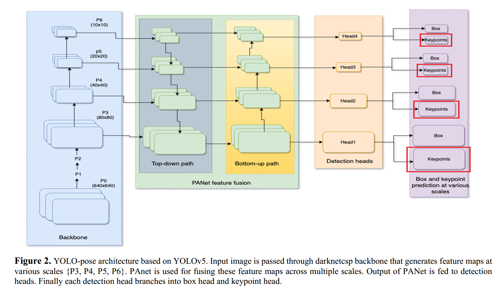
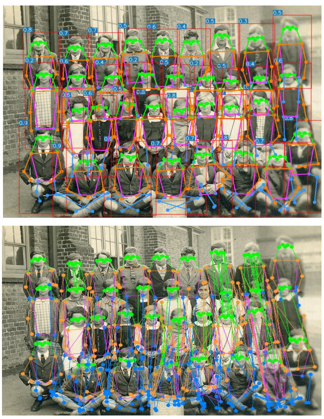
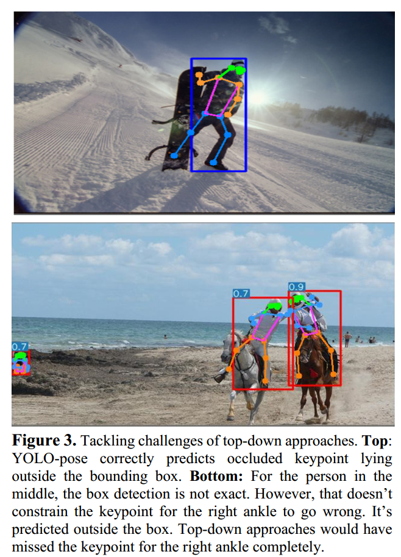
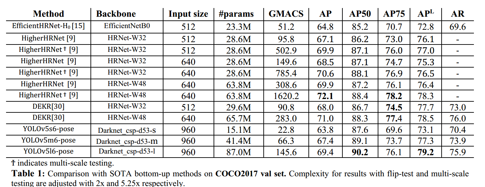
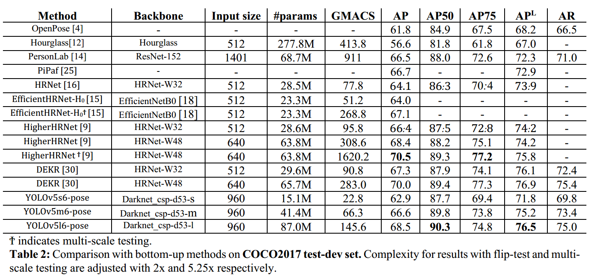
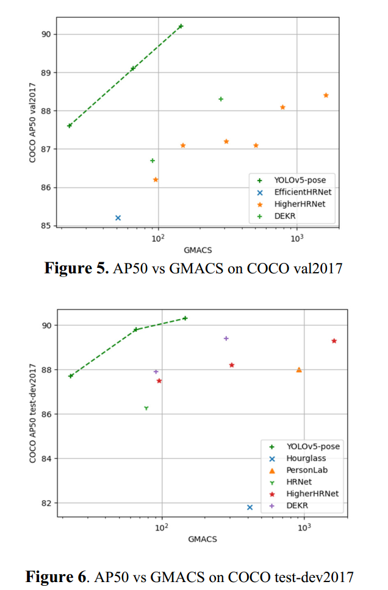
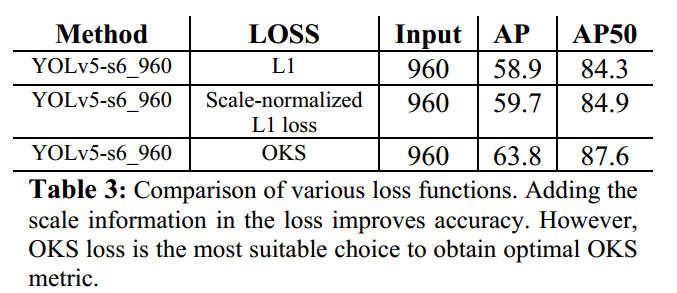
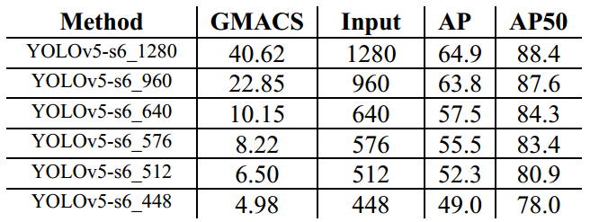
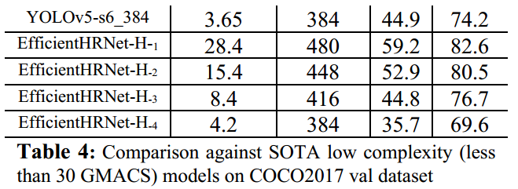
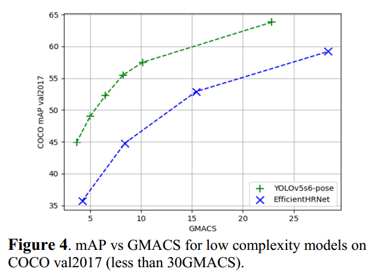

## 介绍&动机
目前主流的关键点检测方法有两大类
* 自上而下的检测方法（`Top-down`）：首先进行使用目标检测模型获取目标的检测框，随后在对每个目标进行关键点检测。
* 自下而上的检测方法（`bottom-up`），首先使用`heatmap regression`或者其他方法获取所有的关键点，随后通过后处理将关键点合并（group）到同一个检测对象中。

    这些关键点检测方法要么是两阶段的检测方法，要么以来复杂的（并且不通用的）后处理技术，为关键点检测的**实时性**和**准确性**带来了挑战。
    </img>
    因此，`YOLO-pose`被提出用于解决上述问题。与之前模型不用的是，`YOLO-pose`是一个单阶段的关键点检测模型，不依赖任何的热图检测方法（`heatmap`），yolo的目标检测模型基础上额外地增加了关键点检测头（`keypoint head`），得益于yolo原生的目标检测模型，`YOLO-pose`仅仅使用目标检测阶段的后处理方法，而无需在关键点检测层面考虑复杂的后处理的方法.其次单阶段的关键检测模型为`YOLO-pose`带来**实时性**检测的可能。

## 方法(细节)
</img>
YOLO-Pose使用`CSP-darknet 53`作为主干，`PANet`用于融合主干中各种尺度的特征。这之后是不同尺度的四个检测头。最后，有两个解耦头用于预测框和关键点。

### overvirw
* 单个关键点预测头（`keypoint head`）的*预测对象:$\{x,y,conf\}$
* 检测头(`detection head`)和所有关键点预测头（`keypoint head`）：$\{C_x,C_y, W, H, box_{conf}, class_{conf}, K_{x}^{1},K_{y}^{1},K_{conf}^{1}......K_{x}^{n},K_{y}^{n},K_{conf}^{n}\}$
> 关键点置信度（$K_{conf}^{n}$）基于该关键点的可见性标志进行训练。如果关键点可见(`visible`)或被遮挡(`occluded`)，则地面实况置信度设置为1，否则如果关键点在视场之外(`invisible`)，则置信度设置为0。在推理过程中，我们保留置信度大于0.5的关键点。所有其他预测的关键点都被拒绝。预测的关键点置信度不用于评估阶段。

> 
> 框坐标相($C_x,C_y, W, H$)对于锚中心进行转换，而框尺寸相对于锚的高度和宽度进行标准化。同样，关键点位置相对于锚中心进行转换$K_{x}^{n},K_{y}^{n}$。但是，关键点不会使用锚高度和宽度进行标准化。

### loss funtion (yolo v5)

#### IoU Based Bounding-box Loss Function——`CIoU`
`CIoU`是一种尺度不变（scale-invariant）的损失函数
$$L_{box}(s,i,j,k)=(1-CIoU(Box_{gt}^{s,i,j,k}, Box_{pred}^{s,i,j,k}))$$
> $Box_{pred}^{s,i,j,k}$第$s$个尺度的第$k$处的锚的预测框$(i,j)$的box

#### OKS（Object keypoint similarity）
在关键点的情况下，对象关键点相似性（OKS）被视为目标检测的IOU。 OKS损失本质上是尺度不变的（scale-invariant），并且对某些关键点比其他关键点更重要。

> 与普通的IoU损失不同，在非重叠情况下会出现梯度消失，OKS损失永远不会达到平台。因此，OKS损失更类似于dIoU损失函数。

$$L_{kpts}(s,i,j,k)=1-\sum_{n=1}^{N_{kpts}}OKS \\ = 1-\frac{\sum_{n=1}^{N_{kpts}}exp(\frac{d_{n}^{2}}{2s^{2}k_{n}^{2}})\delta(v_n>0)}{\sum_{n=1}^{N_{kpts}}\delta(v_n>0)}$$

> * $d_{n}$:第$n$个关键点的预测值和真实值之间的欧几里得距离
> * $k_{n}$ 第$n$个关键点的权重
> * $s$:第$s$个尺度
> * $\delta(v_n>0)$:关键点的可见标志

### visibility flags

$$L_{kpts\_conf}(s,i,j,k)=1-\sum_{n=1}^{N_{kpts}}BCE(\delta(v_n>0), p_{kpts}^{n}) $$
> * $p_{kpts}^{n}$第n个关键点点的可见值的预测结果

### Total loss

$L_{total}=\sum_{s,i.j,k}(\lambda_{cls}L_{cls}+\lambda_{box}L_{box}+\lambda_{kpts}L_{kpts}+\lambda_{kpts\_conf}L_{kpts\_conf})$
> * $\lambda_{cls}=0.5$
> * $\lambda_{box}=0.05$
> * $\lambda_{kpts}=0.1$
> * $\lambda_{kpts\_conf}=0.5$


## 效果
### 与自下而上（`bottom-up`）的方法对比
</img>

* 上方:`YOLO-pose`方法
* 下方：`bottom-up`方法
`Yolo-pose`成功地将不同的对象进行区分，而`bottom-up`比较容易将不同实体的关键点进行混合

### 关键点在box之外
</img>

虽然`YOLO-pose`的`bbox`不是很准，但是仍然成功将**框外的关键点**(`keypoint` out of bbox)检测出来了

### 在COCO数据集上的表现
</img>
</img>

`Yolo-pose`在COCO数据的测试集和验证集上均取得了优异预测性能

</img>


### Ablation Study: OKS Loss vs L1 Loss. 
</img>

`OKS损失函数`是我们工作的主要贡献之一。由于这种损失与`L1损失函数`不同，`OKS损失函数`是受约束的，因此训练动态更加稳定。在使用`L1损失函数`进行训练时，我们不得不稍微调整损失权重。在YOLv5s6_960上进行的测试表明，使用`OKS损失函数`模型性能显著优于使用`L1损失函数`。我们使用`尺度归一化L1损失函数`训练模型，以检查尺度不变性对损失公式的影响。

### Ablation Study: Across Resolution.(分辨率的影响)
</img>
</img>

我们选择960作为基本分辨率，因为在此分辨率下我们能够获得具有竞争力的性能。超过此分辨率，性能增益将达到很大程度的饱和。

</img>

即使在低分辨率场景下，`YOlo-pose`模型仍然优于现有的模型

> GMACS (Giga Multiply-Add Operations per Second):（每秒千兆乘法累加运算），是用于衡量深度学习模型计算效率的指标。 它表示每秒在模型中执行的乘法累加运算的数量，以每秒十亿 (giga) 表示。$$GMACS =（乘法累加运算次数）/（10^{9}）$$。乘加运算的数量通常通过分析网络架构和模型参数的维度来确定，例如权重和偏差。通过 GMACS 指标，研究人员和从业者可以就模型选择、硬件要求和优化策略做出明智的决策，以实现高效且有效的深度学习计算。
```bash
pip install ptflops
```

```python
import torchvision.models as models
import torch
from ptflops import get_model_complexity_info
import re

#Model thats already available
net = models.densenet161()
macs, params = get_model_complexity_info(net, (3, 224, 224), as_strings=True,
print_per_layer_stat=True, verbose=True)
# Extract the numerical value
flops = eval(re.findall(r'([\d.]+)', macs)[0])*2
# Extract the unit
flops_unit = re.findall(r'([A-Za-z]+)', macs)[0][0]

print('Computational complexity: {:<8}'.format(macs))
print('Computational complexity: {} {}Flops'.format(flops, flops_unit))
print('Number of parameters: {:<8}'.format(params))
```

```python
import os
import torch
from torch import nn

class NeuralNetwork(nn.Module):
    def __init__(self):
        super().__init__()
        self.flatten = nn.Flatten()
        self.linear_relu_stack = nn.Sequential(
            nn.Linear(28*28, 512),
            nn.ReLU(),
            nn.Linear(512, 512),
            nn.ReLU(),
            nn.Linear(512, 10),
        )

    def forward(self, x):
        x = self.flatten(x)
        logits = self.linear_relu_stack(x)
        return logits
    
custom_net = NeuralNetwork()

macs, params = get_model_complexity_info(custom_net, (28, 28), as_strings=True,
                                        print_per_layer_stat=True, verbose=True)
# Extract the numerical value
flops = eval(re.findall(r'([\d.]+)', macs)[0])*2

# Extract the unit
flops_unit = re.findall(r'([A-Za-z]+)', macs)[0][0]
print('Computational complexity: {:<8}'.format(macs))
print('Computational complexity: {} {}Flops'.format(flops, flops_unit))
print('Number of parameters: {:<8}'.format(params))
```
> ref:https://medium.com/@ajithkumarv/how-to-calculate-gmac-and-gflops-with-python-62004a753e3b


## 其他
yolo-pose由于其**固定数量**的`关键点检测头`，无法处理关键点数量变化的检测场景，在这种情况下，`heatmap regreession`可能更加适合。


## 参考
> https://arxiv.org/abs/2204.06806