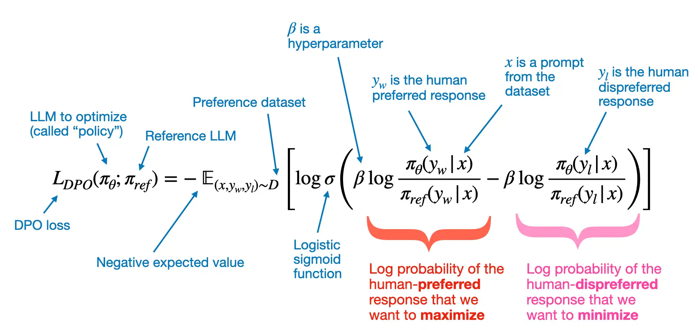

## dataset
* `instruction-data.json`:"https://raw.githubusercontent.com/rasbt/LLMs-from-scratch/main/ch07/01_main-chapter-code/instruction-data.json"
* `instruction-data.json`:"https://raw.githubusercontent.com/rasbt/LLMs-from-scratch/main/ch07/04_preference-tuning-with-dpo/instruction-data-with-preference.json"


## 参考

`gpt-2教程`:https://machinelearningmastery.com/text-generation-with-gpt-2-model/
`gpt-2教程`:https://colab.research.google.com/drive/13dZVYEOMhXhkXWfvSMVM1TTtUDrT6Aeh#scrollTo=vCPohrZ-CTWu
`gpt-2指令微调`:https://www.kaggle.com/code/umerhaddii/gpt-instruction-fine-tuning
`gpt-2dpo微调`：ref:https://github.com/rasbt/LLMs-from-scratch/blob/main/ch07/04_preference-tuning-with-dpo/dpo-from-scratch.ipynb

## TODO
add some metric to evaluate the performance of model

## loss function of `DPO`
- After we took care of the model loading and dataset preparation in the previous sections, we can now get to the fun part and code the DPO loss
- Note that the DPO loss code below is based on the method proposed in the [Direct Preference Optimization: Your Language Model is Secretly a Reward Model](https://arxiv.org/abs/2305.18290) paper
- For reference, the core DPO equation is shown again below:

</img>


- In the equation above,
  - "expected value" $\mathbb{E}$ is statistics jargon and stands for the average or mean value of the random variable (the expression inside the brackets); optimizing $-\mathbb{E}$ aligns the model better with user preferences
  - The $\pi_{\theta}$ variable is the so-called policy (a term borrowed from reinforcement learning) and represents the LLM we want to optimize; $\pi_{ref}$ is a reference LLM, which is typically the original LLM before optimization (at the beginning of the training, $\pi_{\theta}$ and $\pi_{ref}$ are typically the same)
  - $\beta$ is a hyperparameter to control the divergence between the $\pi_{\theta}$ and the reference model; increasing $\beta$ increases the impact of the difference between
$\pi_{\theta}$ and $\pi_{ref}$ in terms of their log probabilities on the overall loss function, thereby increasing the divergence between the two models
  - the logistic sigmoid function, $\sigma(\centerdot)$ transforms the log-odds of the preferred and rejected responses (the terms inside the logistic sigmoid function) into a probability score 
- In code, we can implement the DPO loss as follows:
```python
import torch.nn.functional as F

def compute_dpo_loss(
      model_chosen_logprobs,
      model_rejected_logprobs,
      reference_chosen_logprobs,
      reference_rejected_logprobs,
      beta=0.1,
    ):
    """Compute the DPO loss for a batch of policy and reference model log probabilities.

    Args:
        policy_chosen_logprobs: Log probabilities of the policy model for the chosen responses. Shape: (batch_size,)
        policy_rejected_logprobs: Log probabilities of the policy model for the rejected responses. Shape: (batch_size,)
        reference_chosen_logprobs: Log probabilities of the reference model for the chosen responses. Shape: (batch_size,)
        reference_rejected_logprobs: Log probabilities of the reference model for the rejected responses. Shape: (batch_size,)
        beta: Temperature parameter for the DPO loss; typically something in the range of 0.1 to 0.5. We ignore the reference model as beta -> 0.

    Returns:
        A tuple of three tensors: (loss, chosen_rewards, rejected_rewards).
    """

    model_logratios = model_chosen_logprobs - model_rejected_logprobs
    reference_logratios = reference_chosen_logprobs - reference_rejected_logprobs
    logits = model_logratios - reference_logratios

    # DPO (Eq. 7 of https://arxiv.org/pdf/2305.18290.pdf)
    losses = -F.logsigmoid(beta * logits)

    # Optional values to track progress during training
    chosen_rewards = (model_chosen_logprobs - reference_chosen_logprobs).detach()
    rejected_rewards = (model_rejected_logprobs - reference_rejected_logprobs).detach()

    # .mean() to average over the samples in the batch
    return losses.mean(), chosen_rewards.mean(), rejected_rewards.mean()
```