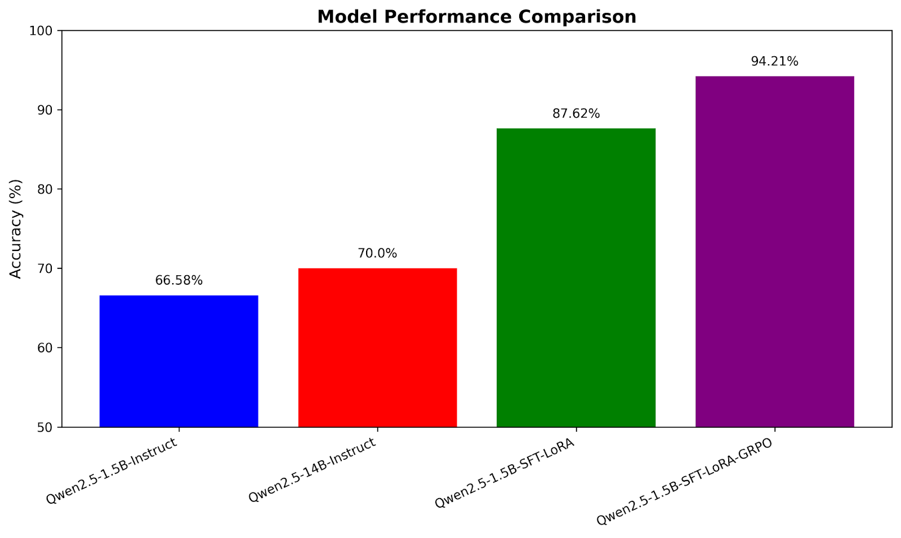

<!-- START doctoc generated TOC please keep comment here to allow auto update -->
<!-- DON'T EDIT THIS SECTION, INSTEAD RE-RUN doctoc TO UPDATE -->
**Table of Contents**  *generated with [DocToc](https://github.com/thlorenz/doctoc)*

- [GRPO简介](#grpo%E7%AE%80%E4%BB%8B)
- [复现对比](#%E5%A4%8D%E7%8E%B0%E5%AF%B9%E6%AF%94)
- [报错](#%E6%8A%A5%E9%94%99)
  - [nltk导入失败失败](#nltk%E5%AF%BC%E5%85%A5%E5%A4%B1%E8%B4%A5%E5%A4%B1%E8%B4%A5)
    - [解决方案](#%E8%A7%A3%E5%86%B3%E6%96%B9%E6%A1%88)
  - [`evaluate`的metric和`huggingface`的model下载慢(重要)](#evaluate%E7%9A%84metric%E5%92%8Chuggingface%E7%9A%84model%E4%B8%8B%E8%BD%BD%E6%85%A2%E9%87%8D%E8%A6%81)
- [实现细节&重要参数（待添加）](#%E5%AE%9E%E7%8E%B0%E7%BB%86%E8%8A%82%E9%87%8D%E8%A6%81%E5%8F%82%E6%95%B0%E5%BE%85%E6%B7%BB%E5%8A%A0)
  - [运行](#%E8%BF%90%E8%A1%8C)
- [问题](#%E9%97%AE%E9%A2%98)
- [建议](#%E5%BB%BA%E8%AE%AE)
- [其他](#%E5%85%B6%E4%BB%96)

<!-- END doctoc generated TOC please keep comment here to allow auto update -->

## GRPO简介
GRPO的核心思想是通过组内相对奖励来估计基线（baseline），从而避免使用额外的价值函数模型（critic model）。传统的PPO算法需要训练一个**价值函数**来估计优势函数（advantage function），而GRPO通过从同一问题的多个输出中**计算平均奖励**来替代这一过程，显著减少了内存和计算资源的消耗。

所以将GRPO迁移到其他领域，只需要对奖励函数进行修改和定义，可以是基于规则的奖励函数页可以是奖励模型所给出的奖励函数。（有一种大道至简的感觉）

GRPO的训练流程
1. 初始化
* 策略模型 $\pi_{\theta}$ ，通常是基于预训练之后的模型
* 奖励模型 $r_{\phi}$ ，对模型的输出进行评分
* 参考模型 $\pi_{ref}$ ，通常是基于预训练之后的模型，用于计算KL散度，防止策略模型过度偏离初始的模型（类似于正则化的作用）
2.  采样输出
对于输入：
* 从当时模型 $\pi_{old}$ 中采样一组输出 ${o_1, o_2, o_3,...,o_{G}}$ ,其中 $G$ 是组的大小（比如 $G=64$ ）
* 使用奖励模型 $r_{\phi}$ 对每个输出进行评分，得到对应的精力 $r_i$
3. 归一化奖励

$$mean(r) = \frac{1}{G}\sum_{i=1}^{G}r_{i}$$
$$std(r)=\sqrt{\frac{1}{G}\sum_{i=1}^{G}(r_{i}-mean(r))^2}$$
$$\hat{r_i} = \frac{r_i-mean(r)}{std(r)}$$

4. 计算优势函数
对于每个输出$o_i$，每个时间步


> ref：https://zhuanlan.zhihu.com/p/20021693569


## 复现对比
| 项目                                   | 链接                                                                                                           | 备注                                      | 推介指数 |
|--------------------------------------|--------------------------------------------------------------------------------------------------------------|-----------------------------------------|----------|
| `Image_Caption_GRPO`                 | [train_with_grpo.py](https://github.com/liangxu-one/ms-models/blob/image_caption_grpo/research/arxiv_papers/Image_Caption_GRPO/train_with_grpo.py) | 有些包不好安装, 没有实现,|     |
| `SFT+GRPO 混合训练`                  | [Medical_QA_Bart_w_GRPO_Fine-Tuning.py](https://www.kaggle.com/code/stpeteishii/medical-qa-bart-w-grpo-fine-tuning) | 没有加KL散度限制，不一定有效                         |   |
| `Minimal-GRPO`                       | [Minimal-GRPO:GitHub](https://github.com/Bharath2/Minimal-GRPO)                                                           | 出现`loss`的梯度为None的情况            |     |
| `GRPO-Zero`                          | [GRPO-Zero:GitHub](https://github.com/policy-gradient/GRPO-Zero)                                                              | 数据和模型需要手动下载                  |     |
| [`GRPO_encoder_decoder.py`](./GRPO_encoder_decoder.py) | [The Hundred-Page Language Models Book:GitHub](https://github.com/aburkov/theLMbook)                                                              | 没啥太大问题, 由[`GRPO.py`](./GRPO.py) 更改而来               | √   |
| [`grpo_encoder_decoder_summarization.py`](./grpo_encoder_decoder_summarization_v2.py) | [grpo_encoder_decoder_summarization.py](https://gist.github.com/jogonba2/9bee8bb154a292b24850f1483daa6b71) | 缺点，`old_model`拷贝了一份模型                             |  √√  |   
| [`grpo_encoder_decoder_summarization_v2.py`](./grpo_encoder_decoder_summarization_v2.py) | [grpo_encoder_decoder_summarization_v2.py](https://gist.github.com/jogonba2/9bee8bb154a292b24850f1483daa6b71) | 参照https://github.com/Bharath2/Minimal-GRPO, old_scores计算一次，current_scores计算4次，去除了`old_model` |  √√  |   

* grpo_encoder_decoder_summarization.py 287113样本，单卡训练一个epoch需要32h
* grpo_encoder_decoder_summarization_v2.py 287113样本，单卡训练一个epoch需要145h
* grpo_encoder_decoder_summarization_pl.py , grpo_encoder_decoder_summarization.py进阶版，支持多卡训练

## 报错
### nltk导入失败失败
```markdown
LookupError: 
**********************************************************************
  Resource punkt_tab not found.
  Please use the NLTK Downloader to obtain the resource:

  >>> import nltk
  >>> nltk.download('punkt_tab')
  
  For more information see: https://www.nltk.org/data.html

  Attempted to load tokenizers/punkt_tab/english/

  Searched in:
    - '/home/lingjiebao/anaconda3/envs/py39/nltk_data'
    - '/home/lingjiebao/nltk_data'
    - '/home/lingjiebao/anaconda3/envs/py39/nltk_data'
    - '/home/lingjiebao/anaconda3/envs/py39/share/nltk_data'
    - '/home/lingjiebao/anaconda3/envs/py39/lib/nltk_data'
    - '/usr/share/nltk_data'
    - '/usr/local/share/nltk_data'
    - '/usr/lib/nltk_data'
    - '/usr/local/lib/nltk_data'
**********************************************************************
```

#### 解决方案
手动下载在<a href="http://www.nltk.org/nltk_data/">http://www.nltk.org/nltk_data/</a>下载`punkt_tab.zip`, 然后解压到`下述任意目录/tokernizer/`文件夹下

```markdown
- '/home/lingjiebao/anaconda3/envs/py39/nltk_data'
- '/home/lingjiebao/nltk_data'
- '/home/lingjiebao/anaconda3/envs/py39/nltk_data'
- '/home/lingjiebao/anaconda3/envs/py39/share/nltk_data'
- '/home/lingjiebao/anaconda3/envs/py39/lib/nltk_data'
- '/usr/share/nltk_data'
- '/usr/local/share/nltk_data'
- '/usr/lib/nltk_data'
- '/usr/local/lib/nltk_data'
```

### `evaluate`的metric和`huggingface`的model下载慢(重要)
国内使用huggingface的镜像
```bash
export HF_ENDPOINT=https://hf-mirror.com
```

## 实现细节&重要参数（待添加）
### 运行
```bash
python grpo_encoder_decoder_summarization.py
```


## 问题
* `Trl`的`GRPOTrainer`对动态生成的数据似乎不大友好
ref:https://github.com/huggingface/trl/issues/2942


## 建议
先进行`SFT`微调，再进行`GRPO`微调
</img>
> ref:https://rabiloo.com/blog/fine-tuning-a-reasoning-model-with-grpo-for-passport-data-extraction


## 其他
* GRPO的简单实现
ref:https://zhuanlan.zhihu.com/p/22924256925