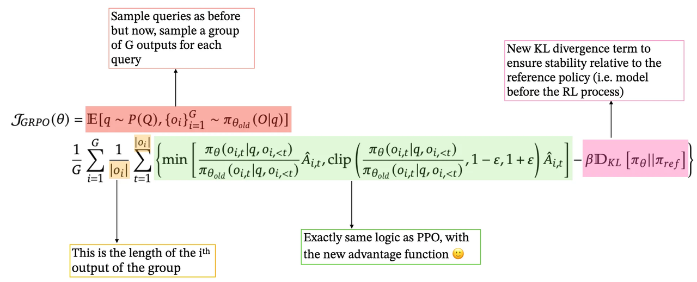
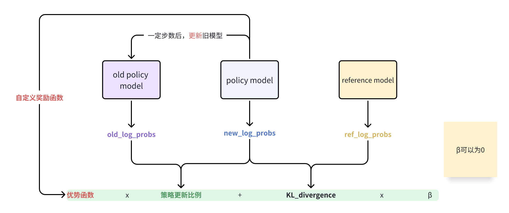
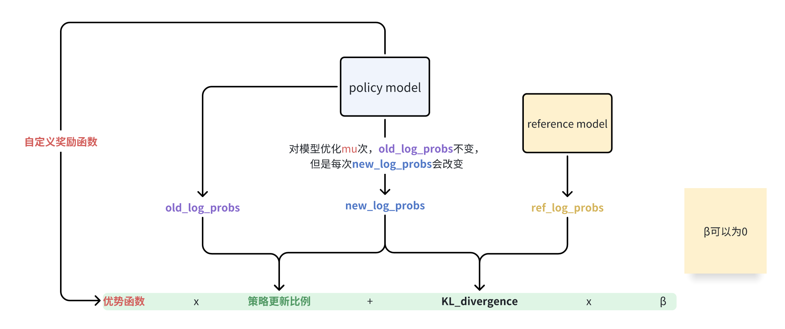

<!-- START doctoc generated TOC please keep comment here to allow auto update -->
<!-- DON'T EDIT THIS SECTION, INSTEAD RE-RUN doctoc TO UPDATE -->
**Table of Contents**  *generated with [DocToc](https://github.com/thlorenz/doctoc)*

- [GRPO简介](#grpo简介)
  - [GRPO的训练流程](#grpo的训练流程)
  - [GRPO的训练流程图](#grpo的训练流程图)
    - [流程1](#流程1)
    - [流程2](#流程2)
- [复现对比（decoder-only改encoder-decoder模型或者就是encoder-decoder模型）](#复现对比decoder-only改encoder-decoder模型或者就是encoder-decoder模型)
- [报错](#报错)
  - [nltk导入失败失败](#nltk导入失败失败)
    - [解决方案](#解决方案)
  - [`evaluate`的metric和`huggingface`的model下载慢(重要)](#evaluate的metric和huggingface的model下载慢重要)
- [实现细节\&重要参数（待添加）](#实现细节重要参数待添加)
  - [运行](#运行)
    - [需要修改的地方（运行相关）：](#需要修改的地方运行相关)
    - [需要确认的地方](#需要确认的地方)
    - [其他和GRPO相关的参数](#其他和grpo相关的参数)
- [问题](#问题)
- [建议](#建议)
- [其他](#其他)
- [vllm——grpo](#vllmgrpo)
- [Installation](#installation)
- [其他实现参考](#其他实现参考)

<!-- END doctoc generated TOC please keep comment here to allow auto update -->

## GRPO简介
GRPO的核心思想是通过组内相对奖励来估计基线（baseline），从而避免使用额外的价值函数模型（critic model）。传统的PPO算法需要训练一个**价值函数**来估计优势函数（advantage function），而GRPO通过从同一问题的多个输出中**计算平均奖励**来替代这一过程，显著减少了内存和计算资源的消耗。

所以将GRPO迁移到其他领域，只需要对奖励函数进行修改和定义，可以是基于规则的奖励函数页可以是奖励模型所给出的奖励函数。（有一种大道至简的感觉）

### GRPO的训练流程
1. 初始化
* 策略模型 $\pi_{\theta}$ ，通常是基于预训练之后的模型
* 奖励模型 $r_{\phi}$ ，对模型的输出进行评分
* 参考模型 $\pi_{ref}$ ，通常是基于预训练之后的模型，用于计算KL散度，防止策略模型过度偏离初始的模型（类似于正则化的作用）
2.  采样输出
对于输入：
* 从当时模型 $\pi_{old}$ 中采样一组输出 ${o_1, o_2, o_3,...,o_{G}}$ ,其中 $G$ 是组的大小（比如 $G=64$ ）
* 使用奖励模型 $r_{\phi}$ 对每个输出进行评分，得到对应的精力 $r_i$
3. 归一化奖励

$$mean(r) = \frac{1}{G}\sum_{i=1}^{G}r_{i}$$
$$std(r)=\sqrt{\frac{1}{G}\sum_{i=1}^{G}(r_{i}-mean(r))^2}$$
$$\hat{r_i} = \frac{r_i-mean(r)}{std(r)}$$

4. 计算优势函数
对于每个输出 $o_i$ ，每个时间步 $t$ 的优势函数 $A_{i,t}=\hat{r_i}$

5. 最大化目标函数

</img>

> ref：https://zhuanlan.zhihu.com/p/20021693569

### GRPO的训练流程图
#### 流程1
</img>


ref：[grpo_encoder_decoder_summarization.py](https://gist.github.com/jogonba2/9bee8bb154a292b24850f1483daa6b71)

#### 流程2
</img>

> 去除了old policy model

ref： [The Hundred-Page Language Models Book:GitHub](https://github.com/aburkov/theLMbook)

`reference model`可以在模型训练一定步数后，更新为最新的`policy model`
> ref: https://github.com/Jaykef/ai-algorithms/blob/main/grpo_multimodal_reasoner.ipynb


## 复现对比（decoder-only改encoder-decoder模型或者就是encoder-decoder模型）
| 项目                                   | 链接                                                                                                           | 备注                                      | 推介指数 |
|--------------------------------------|--------------------------------------------------------------------------------------------------------------|-----------------------------------------|----------|
| `Image_Caption_GRPO`                 | [train_with_grpo.py](https://github.com/liangxu-one/ms-models/blob/image_caption_grpo/research/arxiv_papers/Image_Caption_GRPO/train_with_grpo.py) | 有些包不好安装, 没有实现,|     |
| `SFT+GRPO 混合训练`                  | [Medical_QA_Bart_w_GRPO_Fine-Tuning.py](https://www.kaggle.com/code/stpeteishii/medical-qa-bart-w-grpo-fine-tuning) | 没有加KL散度限制，不一定有效                         |   |
| `Minimal-GRPO`                       | [Minimal-GRPO:GitHub](https://github.com/Bharath2/Minimal-GRPO)                                                           | 出现`loss`的梯度为None的情况            |     |
| `GRPO-Zero`                          | [GRPO-Zero:GitHub](https://github.com/policy-gradient/GRPO-Zero)                                                              | 数据和模型需要手动下载                  |     |
| [`GRPO_encoder_decoder.py`](./GRPO_encoder_decoder.py) | [The Hundred-Page Language Models Book:GitHub](https://github.com/aburkov/theLMbook)                                                              | 没啥太大问题, 由[`GRPO.py`](./GRPO.py) 更改而来               | √   |
| [`grpo_encoder_decoder_summarization.py`](./grpo_encoder_decoder_summarization_v2.py) | [grpo_encoder_decoder_summarization.py](https://gist.github.com/jogonba2/9bee8bb154a292b24850f1483daa6b71) | 缺点，`old_model`拷贝了一份模型                             |  √√  |   
| [`grpo_encoder_decoder_summarization_v2.py`](./grpo_encoder_decoder_summarization_v2.py) | [grpo_encoder_decoder_summarization_v2.py](https://gist.github.com/jogonba2/9bee8bb154a292b24850f1483daa6b71) | 参照https://github.com/Bharath2/Minimal-GRPO, old_scores计算一次，current_scores计算4次，去除了`old_model` |  √√  |   

* grpo_encoder_decoder_summarization.py 287113样本，单卡训练一个epoch需要32h
* grpo_encoder_decoder_summarization_v2.py 287113样本，单卡训练一个epoch需要145h
* grpo_encoder_decoder_summarization_pl.py , grpo_encoder_decoder_summarization.py进阶版，支持多卡训练


1000条训练数据，100条验证数据以及100测试数据的训练20轮复现结果，感觉好像没啥优势啊啊啊啊啊啊啊啊啊啊啊啊啊啊啊啊啊啊
`rouge (top1)`
| ~~方法~~          | ~~val/score~~ | ~~test/score~~ |
|---------------|-----------|------------|
| ~~ori~~           | ~~0.276~~     | ~~0.297~~      |
| ~~sft(lora)~~     | ~~0.278~~     | ~~0.300~~      |
| ~~grpo+lora~~     | ~~0.290~~     | ~~0.284~~      |
| ~~grpo~~          | ~~0.267~~     | ~~0.298~~      |

~~唯一能确定的就是`grpo+lora`在验证集上`可能`有效果~~


| Method    | Train Score | Val Score | Test Score |
|-----------|-------------|-----------|------------|
| ORI       | 0.300       | 0.283     | 0.290      |
| SFT(LORA) | 0.323       | 0.283     | 0.300      |
| GRPO+LORA | 0.304       | 0.287     | 0.298      |
| GRPO      | 0.306       | 0.286     | 0.300      |

唯一能确定的就是比原始的模型效果好

TODO: 后续增加数据集继续验证，或者构造思维链的数据集/使用思维链的模型继续验证
> ref:https://arxiv.org/html/2309.13182v2


## 报错
### nltk导入失败失败
```markdown
LookupError: 
**********************************************************************
  Resource punkt_tab not found.
  Please use the NLTK Downloader to obtain the resource:

  >>> import nltk
  >>> nltk.download('punkt_tab')
  
  For more information see: https://www.nltk.org/data.html

  Attempted to load tokenizers/punkt_tab/english/

  Searched in:
    - '/home/lingjiebao/anaconda3/envs/py39/nltk_data'
    - '/home/lingjiebao/nltk_data'
    - '/home/lingjiebao/anaconda3/envs/py39/nltk_data'
    - '/home/lingjiebao/anaconda3/envs/py39/share/nltk_data'
    - '/home/lingjiebao/anaconda3/envs/py39/lib/nltk_data'
    - '/usr/share/nltk_data'
    - '/usr/local/share/nltk_data'
    - '/usr/lib/nltk_data'
    - '/usr/local/lib/nltk_data'
**********************************************************************
```

#### 解决方案
手动下载在<a href="http://www.nltk.org/nltk_data/">http://www.nltk.org/nltk_data/</a>下载`punkt_tab.zip`, 然后解压到`下述任意目录/tokernizer/`文件夹下

```markdown
- '/home/lingjiebao/anaconda3/envs/py39/nltk_data'
- '/home/lingjiebao/nltk_data'
- '/home/lingjiebao/anaconda3/envs/py39/nltk_data'
- '/home/lingjiebao/anaconda3/envs/py39/share/nltk_data'
- '/home/lingjiebao/anaconda3/envs/py39/lib/nltk_data'
- '/usr/share/nltk_data'
- '/usr/local/share/nltk_data'
- '/usr/lib/nltk_data'
- '/usr/local/lib/nltk_data'
```

### `evaluate`的metric和`huggingface`的model下载慢(重要)
国内使用huggingface的镜像
```bash
export HF_ENDPOINT=https://hf-mirror.com
```

## 实现细节&重要参数（待添加）
### 运行
```bash
python grpo_encoder_decoder_summarization_pl.py
```
#### 需要修改的地方（运行相关）：
- `dataset`&`dataloader`：改变成自己的数据加载和处理方式
  - `dataset`:[./grpo_encoder_decoder_summarization_pl.py#L472-L474]([./grpo_encoder_decoder_summarization_pl.py#L472-L474](https://github.com/LingjieBao1998/Unlimited-Learning/blob/main/RL/grpo_learning/grpo_encoder_decoder_summarization_pl.py#L472-L474))
  ```python
    self.train_dataset = self.dataset["train"]
    self.val_dataset = self.dataset["validation"]
    self.test_dataset = self.dataset["test"]
  ```
  - `dataloader`:[./grpo_encoder_decoder_summarization_pl.py#L501-L557]([./grpo_encoder_decoder_summarization_pl.py#L472-L474](https://github.com/LingjieBao1998/Unlimited-Learning/blob/main/RL/grpo_learning/grpo_encoder_decoder_summarization_pl.py#L501-L557))
  ```python
      def train_dataloader(self):
        if self.training_args.debug is False:
            ## 瓶颈不在数据
            # return torch.utils.data.DataLoader(
            #     self.dataset["train"], batch_size=self.training_args.batch_size, num_workers=self.training_args.num_workers,
            #     collate_fn=DataCollatorForSeq2Seq(self.tokenizer), prefetch_factor=2, persistent_workers=True, pin_memory=True,
            #     shuffle=True)
            return torch.utils.data.DataLoader(
                self.train_dataset,
                batch_size=self.training_args.batch_size,
                num_workers=self.training_args.num_workers,
                collate_fn=DataCollatorForSeq2Seq(self.tokenizer),
                shuffle=True,
            )
        else:
            ## 单线程调试
            return torch.utils.data.DataLoader(
                self.train_dataset,
                batch_size=self.training_args.batch_size,
                num_workers=0,
                collate_fn=DataCollatorForSeq2Seq(self.tokenizer),
                shuffle=True,
            )

    def val_dataloader(self):
        if self.training_args.debug is False:
            return torch.utils.data.DataLoader(
                self.val_dataset,
                batch_size=self.training_args.batch_size * 2,
                num_workers=self.training_args.num_workers,
                collate_fn=DataCollatorForSeq2Seq(self.tokenizer),
            )
        else:
            ## 单线程调试
            return torch.utils.data.DataLoader(
                self.val_dataset,
                batch_size=self.training_args.batch_size * 2,
                num_workers=0,
                collate_fn=DataCollatorForSeq2Seq(self.tokenizer),
            )

    def test_dataloader(self):
        if self.training_args.debug is False:
            return torch.utils.data.DataLoader(
                self.test_dataset,
                batch_size=self.training_args.batch_size * 2,
                num_workers=self.training_args.num_workers,
                collate_fn=DataCollatorForSeq2Seq(self.tokenizer),
            )
        else:
            ## 单线程调试
            return torch.utils.data.DataLoader(
                self.test_dataset,
                batch_size=self.training_args.batch_size * 2,
                num_workers=0,
                collate_fn=DataCollatorForSeq2Seq(self.tokenizer),
            )
  ```
  > `self.training_args.debug`为`True`为单进程调试模式 
- `compute_rewards`：换成自己的奖励函数（打分函数），奖励函数可以多个如果奖励函数有多个，请给每个奖励函数输出的值一个**权重**（可以直接进行平均）
  - [./grpo_encoder_decoder_summarization_pl.py#L223-L247](https://github.com/LingjieBao1998/Unlimited-Learning/blob/main/RL/grpo_learning/grpo_encoder_decoder_summarization_pl.py#L223-L247)
  ```python
    def compute_rewards(
        token_ids: LongTensor, labels: LongTensor, tokenizer: PreTrainedTokenizer
    ) -> BatchRewards:
        """
        Compute rewards based on the ROUGE avg score between generated completions and reference summaries.
        Args:
            token_ids (LongTensor): Tensor containing token IDs of the generated completions.
            labels (LongTensor): Tensor containing token IDs of the reference summaries.
            tokenizer (PreTrainedTokenizer): Tokenizer used to decode the token IDs.
        Returns:
            BatchRewards: A tensor containing the computed rewards for each completion.
        """
        labels[labels == -100] = tokenizer.pad_token_id
        completions = tokenizer.batch_decode(token_ids, skip_special_tokens=True)
        summaries = tokenizer.batch_decode(labels, skip_special_tokens=True)
        completions, summaries = postprocess_text(completions, summaries)

        rewards = torch.zeros(token_ids.shape[0], device=token_ids.device)
        for idx, (completion, summary) in enumerate(zip(completions, summaries)):
            rouge_score = rouge_reward(
                predictions=[completion], references=[summary]
            )
            rewards[idx] = rouge_score

        return BatchRewards(rewards)
  ```

#### 需要确认的地方
- `model.generate`:[./grpo_encoder_decoder_summarization_pl.py#L617-L624](https://github.com/LingjieBao1998/Unlimited-Learning/blob/main/RL/grpo_learning/grpo_encoder_decoder_summarization_pl.py#L617-L624)
    ```python
    generated_ids = self.old_model.generate(
            input_ids=input_ids,
            attention_mask=attention_mask,
            max_new_tokens=self.training_args.max_new_tokens,
            do_sample=True,
            num_beams=self.training_args.group_size, #default=5
            num_return_sequences=self.training_args.group_size,
        ) # [batch_size * training_args.group_size, max_len]
    ```

#### 其他和GRPO相关的参数
- `update_old_after`: int = 1000  # 更新旧策略的步数
- `group_size` ( $G$ ) : int = 5  # 组大小（GRPO相关）,deepseek原文用了**64**，group_size越大，显存消耗越多
- `grpo_epsilon` ( $\epsilon$ ) : float = 0.1  # GRPO的epsilon参数，控制模型的更新不要太大，增加训练的稳定性
- `grpo_beta` ( $\beta$ ) : float = 0.04  # GRPO的beta参数，限制模型与`reference model`的输出相接近
- `compute_rewards` : 奖励函数，可以是任何奖励，包括格式奖励，正确性奖励
> 第一个是工程化实现相关的参数; 剩下几个和 **GRPO** 公式相关

## 问题
* `Trl`的`GRPOTrainer`对动态生成的数据似乎不大友好
ref:https://github.com/huggingface/trl/issues/2942


## 建议
先进行`SFT`微调，再进行`GRPO`微调
</img>
> ref:https://rabiloo.com/blog/fine-tuning-a-reasoning-model-with-grpo-for-passport-data-extraction


## 其他
* GRPO的简单实现
ref:https://zhuanlan.zhihu.com/p/22924256925


## vllm——grpo
[`Taylor_Swift_ChatBot_with_GRPO.py`](./Taylor_Swift_ChatBot_with_GRPO.py)
> ref:https://blog.gopenai.com/llm-fine-tuning-with-grpo-example-6eebe903907b

**result**
| 指标                | 平均 ROUGE-L F1 分数 (测试集) |
|---------------------|-----------------------------|
| **Before (Previous)** | 0.236                       |
| **After (Post(1 epoch))**      | 0.316                       |
| **After (Post(5 epoch))**      | 0.353                       |

> 感觉`本身具有思维链`的模型更容易训练

**error**
`TypeError: <lambda>() got an unexpected keyword argument 'completion_ids'`

修改

```python
def combined_reward(prompts, completions, answer, model, tokenizer):
    """Combines ROUGE, Length Similarity, and Qwen-0.5B as LLM-J."""

    rouge_scores = rouge_reward_func(prompts, completions, answer)
    length_scores = length_similarity_reward_func(prompts, completions, answer)

    generated_responses = [c[0]["content"] for c in completions]
    llm_scores = llm_judge_reward_batch(
        prompts, generated_responses, answer, model, tokenizer
    )

    # Weighted combination of scores
    final_rewards = [
        (0.3 * rouge) + (0.2 * length) + (0.5 * llm)
        for rouge, length, llm in zip(rouge_scores, length_scores, llm_scores)
    ]

    return final_rewards

trainer = GRPOTrainer(
    model=model,
    processing_class=tokenizer,
    reward_funcs=[
        # TypeError: <lambda>() got an unexpected keyword argument 'completion_ids'
        lambda prompts, completions, answer: combined_reward(
            prompts, completions, answer, model, tokenizer
        )
    ],  # Pass model & tokenizer
    args=training_args,
    train_dataset=dataset,
    peft_config=peft_config,
)
```

为

```python
def combined_reward(prompts, completions, answer, model, tokenizer, completion_ids):
    """Combines ROUGE, Length Similarity, and Qwen-0.5B as LLM-J."""

    rouge_scores = rouge_reward_func(prompts, completions, answer)
    length_scores = length_similarity_reward_func(prompts, completions, answer)

    generated_responses = [c[0]["content"] for c in completions]
    llm_scores = llm_judge_reward_batch(
        prompts, generated_responses, answer, model, tokenizer
    )

    # Weighted combination of scores
    final_rewards = [
        (0.3 * rouge) + (0.2 * length) + (0.5 * llm)
        for rouge, length, llm in zip(rouge_scores, length_scores, llm_scores)
    ]

    return final_rewards

trainer = GRPOTrainer(
    model=model,
    processing_class=tokenizer,
    reward_funcs=[
        # TypeError: <lambda>() got an unexpected keyword argument 'completion_ids'
        lambda prompts, completions, completion_ids, answer: combined_reward(
            prompts, completions, answer, model, tokenizer, completion_ids
        )
    ],  # Pass model & tokenizer
    args=training_args,
    train_dataset=dataset,
    peft_config=peft_config,
)
```

## Installation
> 5090
unsloth installation
```bash
pip install "cut-cross-entropy @ git+https://github.com/apple/ml-cross-entropy.git"
pip install "unsloth[colab-new] @ git+https://github.com/unslothai/unsloth.git"
```


## 其他实现参考
`grpo-fine-tuning-on-deepseek-7b`:https://www.analyticsvidhya.com/blog/2025/02/grpo-fine-tuning-on-deepseek-7b/

`grpo+SmolVLM`:https://github.com/Jaykef/ai-algorithms/blob/main/grpo_multimodal_reasoner.ipynb