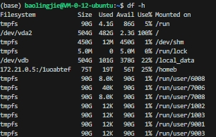
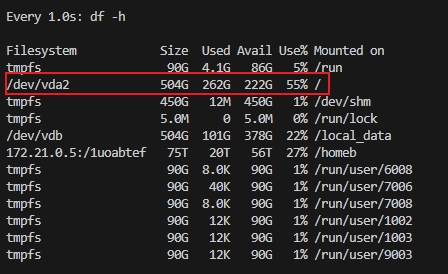

<!-- START doctoc generated TOC please keep comment here to allow auto update -->
<!-- DON'T EDIT THIS SECTION, INSTEAD RE-RUN doctoc TO UPDATE -->
**Table of Contents**  *generated with [DocToc](https://github.com/thlorenz/doctoc)*

  - [docker 安装](#docker-%E5%AE%89%E8%A3%85)
    - [卸载旧版本](#%E5%8D%B8%E8%BD%BD%E6%97%A7%E7%89%88%E6%9C%AC)
    - [使用 APT 安装](#%E4%BD%BF%E7%94%A8-apt-%E5%AE%89%E8%A3%85)
    - [安装 Docker](#%E5%AE%89%E8%A3%85-docker)
    - [启动 Docker](#%E5%90%AF%E5%8A%A8-docker)
    - [nvidia-docker 安装](#nvidia-docker-%E5%AE%89%E8%A3%85)
- [安装依赖](#%E5%AE%89%E8%A3%85%E4%BE%9D%E8%B5%96)
- [添加密钥和仓库](#%E6%B7%BB%E5%8A%A0%E5%AF%86%E9%92%A5%E5%92%8C%E4%BB%93%E5%BA%93)
    - [镜像加速](#%E9%95%9C%E5%83%8F%E5%8A%A0%E9%80%9F)
      - [配置`/etc/docker/daemon.json`](#%E9%85%8D%E7%BD%AEetcdockerdaemonjson)

<!-- END doctoc generated TOC please keep comment here to allow auto update -->

## docker 安装
ref:https://yeasy.gitbook.io/docker_practice/install/ubuntu

### 卸载旧版本
```bash
for pkg in docker \
           docker-engine \
           docker.io \
           docker-doc \
           docker-compose \
           podman-docker \
           containerd \
           runc;
do
    sudo apt remove $pkg;
done
```

### 使用 APT 安装
鉴于国内网络问题，强烈建议使用国内源
为了确认所下载软件包的合法性，需要添加软件源的 GPG 密钥。
```bash
curl -fsSL https://mirrors.aliyun.com/docker-ce/linux/ubuntu/gpg | sudo gpg --dearmor -o /usr/share/keyrings/docker-archive-keyring.gpg
```

然后，我们需要向 `sources.list` 中添加 Docker 软件源
```bash
 echo \
  "deb [arch=amd64 signed-by=/usr/share/keyrings/docker-archive-keyring.gpg] https://mirrors.aliyun.com/docker-ce/linux/ubuntu \
  $(lsb_release -cs) stable" | sudo tee /etc/apt/sources.list.d/docker.list > /dev/null
```

### 安装 Docker
更新 apt 软件包缓存，并安装 docker-ce：
```bash
sudo apt update

sudo apt install docker-ce docker-ce-cli containerd.io
```

### 启动 Docker
```bash
sudo systemctl enable docker
sudo systemctl start docker
```

### nvidia-docker 安装
需要先安装nvidia-cuda-toolkit

如果`apt`中有nvidia-cuda-toolkit可以直接运行下面的命令
```bash
apt update
apt install nvidia-cuda-toolkit
```
这种方式安装简单，但安装的 CUDA Toolkit 版本往往不是最新版本。
否则需要手动去官网下载
```bash
wget https://developer.download.nvidia.com/compute/cuda/12.0.1/local_installers/cuda_12.0.1_525.85.12_linux.run
sudo sh cuda_12.0.1_525.85.12_linux.run
```

添加官方仓库
# 安装依赖
```bash
sudo apt-get update
sudo apt-get install -y curl
```

# 添加密钥和仓库
```bash
curl -fsSL https://nvidia.github.io/libnvidia-container/gpgkey | sudo gpg --dearmor -o /usr/share/keyrings/nvidia-container-toolkit-keyring.gpg
curl -s -L https://nvidia.github.io/libnvidia-container/stable/deb/nvidia-container-toolkit.list | \
  sed 's#deb https://#deb [signed-by=/usr/share/keyrings/nvidia-container-toolkit-keyring.gpg] https://#g' | \
  sudo tee /etc/apt/sources.list.d/nvidia-container-toolkit.list
```

```bash
#2.2 执行安装
sudo apt-get update
sudo apt-get install -y nvidia-container-toolkit
sudo systemctl restart docker #重启服务
docker run --rm --gpus all nvidia/cuda:12.6.0-base-ubuntu24.04 nvidia-smi #测试
```


> ref:https://blog.csdn.net/engchina/article/details/145362226


### 镜像加速
#### 配置`/etc/docker/daemon.json`
* docker的镜像源文件配置在 `/etc/docker/daemon.json`处，如果没有的话我们就创建一个然后再修改。
```file
{
    "registry-mirrors": [
        "https://registry.docker-cn.com",
        "https://docker.mirrors.ustc.edu.cn",
        "https://hub-mirror.c.163.com",
        "https://mirror.baidubce.com",
        "https://ccr.ccs.tencentyun.com"
    ]
}
```
重启docker，注意由于走的是守护程序daemon，所以daemon进程也需要重启。
```bash
sudo systemctl daemon-reload		#重启daemon进程
sudo systemctl restart docker		#重启docker
```
最后我们再验证一下是否修改成功，运行
```bash
docker info
```

有些镜像源会经常失效或者不可用，推荐使用下面的镜像源
**常用镜像源（推荐）**
https://www.coderjia.cn/archives/dba3f94c-a021-468a-8ac6-e840f85867ea

ref: https://blog.csdn.net/Lichen0196/article/details/137355517

## 自动清理 Docker 占用的磁盘空间
```bash
docker system prune -a --volumes
```
⚠️ 命令解释：
* docker system prune：清理未使用的 镜像、容器、网络、构建缓存
* -a：包括未使用的镜像（而不仅是悬空镜像）
* --volumes：包括未使用的 Docker 卷（volumes），这通常占用了大量空间！

⚠️ 注意：此命令会删除：
所有 未被任何容器使用的镜像
所有 停止的容器
所有 未被使用的网络
所有 未被挂载的卷（volumes）
请确保你不需要这些数据！比如数据库卷、日志卷等，删除后可能无法恢复！

previous
</img>

post
</img>

> 清理效果明显