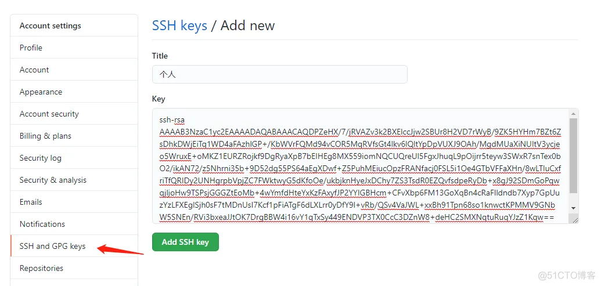

## 基础配置
<a herf="https://blog.51cto.com/u_15077537/4513583">Git配置免密登录Github_51CTO博客_git免密</a>
```bash
git config --global use.name "XXX"#配置用户名
git config --global use.email "XX@XX.com"#配置邮箱
```

## (SSH)免密登入
### 生成公钥和密钥
```bash
ssh-keygen -t rsa -C "邮箱"
```
- 如果是**Windows**系统，创建成功后会在~目录(用户名目录下，比如`C:\Users\Administrator\.ssh`)创建一个.ssh文件夹，
- 如果是**linux**系统，创建成功后会在用户~目录(用户名目录下，比如`~/.ssh`)创建一个.ssh文件夹，id_rsa存放秘钥，id_rsa.pub存放公钥

.ssh文件夹下有以下两个文件
- id_rsa：存放秘钥，
- id_rsa.pub：存放公钥

### 复制SSH公钥并Github添加SSH公钥
显示SSH公钥
```bash
cat ~/.ssh/id_rsa.pub
```
添加公钥到github

</img>

## 一些简单的命令
基本上够用
### git clone
```bash
git clone ${仓库地址}
```

### 推送三部曲（本地代码更新至远端仓库）
#### git add
先创建一个文件
指明那些文件要被保存在本地
```bash
git add XXX.file
```

#### `git commit`
将`git add`的文件保存在本地的仓库
```bash
git commit -m "XXX"
```

#### `git push`
```bash
git push
```

### 拉取
#### `git fetch`
从服务器上拉取最新的文件
```bash
git fetch
```

### 查看分支
查看所有分支：
```bash
git branch
```

查看远程分支：
```bash
git branch -r
```

查看所有本地和远程分支：
```bash
git branch -a
```

## submodule
常见用法：将外部库作为子模块添加到项目中。

### `git submodule add`——添加子模块
```bash
git submodule add <repo-url> [<path>]
```
该命令会将指定的 Git 仓库作为子模块添加到当前仓库中。

<repo-url> 是子模块的仓库地址，<path> 是子模块在主仓库中的路径（可选，如果不指定，默认使用子模块仓库的名称作为路径）。

```bash
git submodule add https://github.com/example/libfoo.git libfoo
```

### `git submodule`
列出子模块
```bash
git submodule
```

### 拉取子模块（或者同步最新的子模块）
#### 直接拉取
```bash
git clone --recursive https://github.com/example/example.git
```
#### 在已经拉取的本地项目中进行更行
**如果项目已经克隆到了本地**，执行下面的步骤：

初始化本地子模块配置文件
```bash
git submodule init
```

更新项目，抓取子模块内容。
```bash
git submodule update
```

ref:https://www.cnblogs.com/codingbit/p/git-clone-with-submodule.html

### 子模块更新（并同步到原始的仓库）
进入子模块
```bash
cd submodule
```

检查子模块有哪些文件发生修改
```bash
git status
```

比如输出

```markdown
HEAD detached at 92d5e68
Changes not staged for commit:
  (use "git add <file>..." to update what will be committed)
  (use "git restore <file>..." to discard changes in working directory)
        modified:   src/img2smiles/pipeline/Processer.py
        modified:   tests/main.py
```
添加已经修改的文件

```bash
git add src/img2smiles/pipeline/Processer.py
git add tests/main.py
```

提交到本地的仓库
```bash
git commit -m "Update submodule"
```

推送到子模块原有的分支
```bash
git push origin HEAD:main
```
> `main`可以改成任意的分支

输出
```markdown
Enumerating objects: 15, done.
Counting objects: 100% (15/15), done.
Delta compression using up to 176 threads
Compressing objects: 100% (8/8), done.
Writing objects: 100% (8/8), 831 bytes | 831.00 KiB/s, done.
Total 8 (delta 5), reused 0 (delta 0), pack-reused 0
remote: Resolving deltas: 100% (5/5), completed with 5 local objects.
To github.com:example/example.git
   92d5e68..ccc7450  HEAD -> main
```

返回主仓库的根目录
```bash
cd main_module
```
提交对子模块的更改。这通常意味着更新子模块的提交信息。
```bash
git add .
```

将子模块的修改同步到本地的缓存区
```bash
git commit -m "Update submodule"
```

将本地的缓存区同步到服务器端
```bash
git push <remote-name> <branch-name>
```
