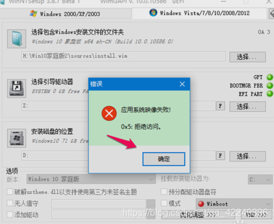

## 问题1——`应用系统镜像失败！0x5：拒绝访问`
</img>

### 解决方案
格式化`C盘`

> ref:https://blog.csdn.net/qq_42249896/article/details/90257890
> 
## 问题2——`0x570:文件损坏且无法读取`

文件不完整

### 解决方案
重新下载镜像

> 在要下载镜像时一定不要把U盘插在主机前面（上面），而是插在主板上，因为插在前者属于在延长线io口上，因为弱电问题可能会导致文件损坏，一定要插到主板上（即后面），其实有时候镜像总是损坏可能并不是U盘本身的问题

> ref:https://www.cnblogs.com/szyx/p/15863696.html

## 问题3——`INACCESSIBLE BOOT DEVICE`

### 解决方案
* 开机后进入 BIOS。
* 找到 `Storage Configuration` 或 `SATA Operation` 选项：
  * 如果当前模式是 `RAID`，尝试改为 `AHCI`（如果之前是 AHCI 安装的系统）。
  * 如果当前模式是 `AHCI`，尝试改为 `RAID`（如果系统最初是 RAID 方式安装的）。
* 保存更改并重启，看看是否能正常进入系统。
### 补充知识——SATA（Serial ATA）
`SATA` 是计算机存储设备（如硬盘、SSD）与主板之间的通信接口。`BIOS` 允许你选择不同的 `SATA` 模式，常见模式有：

* `AHCI`（Advanced Host Controller Interface，高级主机控制器接口）
  * 现代主流模式，支持 NCQ（原生指令队列优化） 和 热插拔。Windows 10、Windows 11 以及大多数 SSD 设备推荐使用 AHCI。
  * AHCI 提供更高的存储性能，特别是 SSD 设备。
* `RAID`（Redundant Array of Independent Disks，独立磁盘冗余阵列）
  * 适用于多个硬盘组成 RAID 磁盘阵列（如 RAID 0/1/5），提高数据安全性或速度。
  * RAID 需要额外的驱动程序，如果 Windows 安装时使用 RAID 模式，后续切换到 AHCI 可能导致 系统无法识别硬盘。

> ref:https://blog.csdn.net/qq_40723205/article/details/145529300
